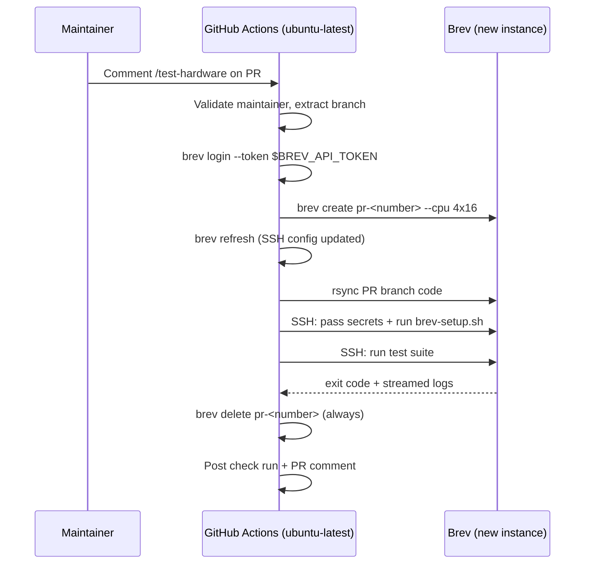

# Ephemeral Brev E2E Test Infrastructure

## Overview & Objectives

### Problem Statement

Security-critical PRs (e.g., #156 — credential sanitization for migration snapshots) cannot be properly tested in CI today. The existing test infrastructure has gaps:

- **Docker sandbox E2E** (PR workflow): Simulated environment using `node:22-slim`. No real OpenShell gateway, no actual sandbox isolation.
- **Nightly cloud E2E** (GitHub-hosted runner): Tests live inference via NVIDIA API but runs on `ubuntu-latest` — no OpenShell, no sandbox creation, no migration flow.
- **Unit tests**: PR #156's tests re-implement production logic locally rather than exercising the real `createSnapshotBundle()` code path.

There is no automated way to test the full stack: host OpenClaw credentials → migration snapshot → credential sanitization → sandbox bundle verification.

### Goals

1. Enable maintainers to trigger full-stack E2E tests against any PR branch
2. Use **ephemeral** Brev instances — create a fresh box per test run, tear it down when done
3. Report results back to the PR (check run + comment)
4. Zero persistent infrastructure to maintain between runs

### Non-Goals

- Replacing the existing Docker sandbox E2E or nightly cloud E2E (they remain as-is)
- Making this a required check on all PRs (it's on-demand, triggered by maintainers)
- GPU testing — OpenShell gateway runs fine on CPU (confirmed)
- Local inference / vLLM — not needed for sandbox and migration testing

## Current State Analysis

### Confirmed: Brev CLI Supports Full Ephemeral Lifecycle

All of the following have been validated:

| Capability | Command | Confirmed |
|-----------|---------|-----------|
| Headless auth | `brev login --token <REFRESH_TOKEN>` | Yes — refresh token from `~/.brev/credentials.json` works |
| Create instance | `brev create <name> --cpu 4x16` | Yes — non-interactive, returns when ready |
| SSH config update | `brev refresh` | Yes — writes `~/.ssh/config` entries, resolves instance name to IP |
| SSH access | `ssh <name> "..."` | Yes — works after `brev refresh` |
| Delete instance | `brev delete <name>` | Yes — non-interactive |

### Confirmed: CPU-Only Bootstrap Works

Validated on `agent-sandbox-f41b14` (Ubuntu 22.04, CPU-only, no GPU):

- `scripts/brev-setup.sh` installs Node.js v22, Docker, OpenShell v0.0.14
- OpenShell gateway starts without `--gpu` flag (CPU-only mode)
- Sandbox created and reaches Ready state
- No GPU driver, NVIDIA toolkit, or vLLM needed

### Required Env Vars for Bootstrap

| Variable | Purpose |
|----------|---------|
| `NVIDIA_API_KEY` | Inference provider configuration during onboarding |
| `GITHUB_TOKEN` | `gh release download` of OpenShell binary from NVIDIA/OpenShell |
| `NEMOCLAW_NON_INTERACTIVE=1` | Skip interactive prompts |
| `NEMOCLAW_SANDBOX_NAME` | Sandbox name for non-interactive onboarding |

### Existing Patterns to Reuse

- `bin/nemoclaw.js` deploy function (lines 136-206): rsync, SSH poll loop, `.env` SCP pattern
- `test/e2e/test-full-e2e.sh` (355 lines): 6-phase E2E test with pass/fail harness
- `test/e2e-test.sh` test #8 (lines 123-212): calls `createSnapshotBundle()` via real TypeScript plugin
- `pr-limit.yaml`: PR comment interaction pattern, maintainer allowlist

## Architecture Design

### Ephemeral Box Per Test Run



**Why ephemeral (not persistent):**
- No state to clean between runs — every test starts fresh
- No idle cost — box only exists during the test
- Reproducible — same bootstrap every time, no drift
- Replaceable — no "the CI box is broken" problems

**Why not a self-hosted runner:**
- Security: fork PRs could execute arbitrary code
- Complexity: runner agent requires maintenance
- Cost: must be always-on to pick up jobs

### Auth Chain

```
GitHub Actions runner (ubuntu-latest)
  ├── brev login --token $BREV_API_TOKEN     (refresh token from ~/.brev/credentials.json)
  ├── brev create pr-<N> --cpu 4x16          (new ephemeral instance)
  ├── brev refresh                            (SSH config updated with new IP)
  └── ssh pr-<N> "export NVIDIA_API_KEY=... && export GITHUB_TOKEN=... && ..."
```

Only 2 secrets needed: `BREV_API_TOKEN` and `NVIDIA_API_KEY`. `GITHUB_TOKEN` is the default workflow token.

## Configuration & Deployment Changes

### Secrets (GitHub Repository)

| Secret | Purpose | How to obtain |
|--------|---------|---------------|
| `NVIDIA_API_KEY` | Inference config during onboarding | Already exists |
| `BREV_API_TOKEN` | Brev CLI headless auth | `brev login` locally, then: `python3 -c "import json; print(json.load(open('$HOME/.brev/credentials.json'))['refresh_token'])"` |

`GITHUB_TOKEN` is automatically available in workflows as `github.token`.

### Dependencies

None. Brev CLI installed on the GitHub runner via curl. All scripts use bash, ssh, rsync.

## Implementation Phases

## Phase 1: Ephemeral Box Orchestration Script

- **Description**: Single bash script that manages the full lifecycle of an ephemeral Brev instance — create, bootstrap, run tests, destroy.
- **Core Functionality**: Create fresh Brev box, sync code, bootstrap, run test suite, capture results, tear down.
- **Dependencies**: Brev CLI available on PATH, `BREV_API_TOKEN` and `NVIDIA_API_KEY` env vars set.
- **New file**: `scripts/e2e-brev-test.sh`
- **Design**:
  - Inputs (env vars):
    - `BREV_API_TOKEN` — for `brev login --token`
    - `NVIDIA_API_KEY` — passed to VM for bootstrap
    - `GITHUB_TOKEN` — passed to VM for OpenShell download
    - `INSTANCE_NAME` — e.g. `pr-156-test` (caller provides, derived from PR number)
    - `TEST_SUITE` — which test to run (default: `full`)
  - Steps:
    1. `brev login --token $BREV_API_TOKEN`
    2. `brev create $INSTANCE_NAME --cpu 4x16 --detached`
    3. `brev refresh` then SSH poll loop (60 attempts, 5s apart) until `ssh $INSTANCE_NAME "echo ok"` succeeds
    4. `rsync -az --delete --exclude node_modules --exclude .git --exclude dist --exclude .venv ./ $INSTANCE_NAME:/home/ubuntu/nemoclaw/`
    5. SSH: `export NVIDIA_API_KEY=... && export GITHUB_TOKEN=... && export NEMOCLAW_NON_INTERACTIVE=1 && export NEMOCLAW_SANDBOX_NAME=e2e-test && bash scripts/brev-setup.sh`
    6. SSH: run selected test script, tee output to local log file
    7. Capture remote exit code
    8. (always, via trap) `brev delete $INSTANCE_NAME`
    9. Exit with captured code
  - Uses `trap` to ensure `brev delete` runs even on script failure/interrupt
  - Reuses patterns from `bin/nemoclaw.js` deploy function (lines 136-206)
- **Unit Test Requirements**:

  Tests to Write:

  1. **test_creates_instance_with_correct_cpu_spec**: Verify `brev create` called with `--cpu 4x16`
  2. **test_ssh_poll_retries_on_failure**: Verify poll loop retries when SSH fails
  3. **test_ssh_poll_fails_after_timeout**: Verify script exits non-zero after 60 failed attempts
  4. **test_cleanup_runs_on_failure**: Verify `brev delete` is called even when test script fails
  5. **test_cleanup_runs_on_interrupt**: Verify `brev delete` is called on SIGINT/SIGTERM
  6. **test_exit_code_propagation**: Verify remote test failure becomes local exit code
  7. **test_rsync_excludes_correct_dirs**: Verify node_modules, .git, dist, .venv excluded

- **Acceptance Criteria**:
  - Running `scripts/e2e-brev-test.sh` creates a Brev instance, bootstraps it, runs tests, and deletes it
  - Instance is always deleted — even on test failure, bootstrap failure, or interrupt
  - Test output is streamed to stdout and saved to a local log file
  - Non-zero exit from remote test propagates to local exit code
  - `brev ls` shows no leftover instances after the script completes

## Phase 2: GitHub Workflow — Hardware E2E

- **Description**: GitHub Actions workflow that triggers the ephemeral test run and reports results back to a PR.
- **Core Functionality**: Trigger via dispatch or reusable call, run `e2e-brev-test.sh`, report results.
- **Dependencies**: Phase 1 (script exists). `BREV_API_TOKEN` secret configured.
- **New file**: `.github/workflows/hardware-e2e.yaml`
- **Design**:
  - Triggers: `workflow_dispatch` (with inputs: branch, pr_number, test_suite) + `workflow_call` (same inputs, for reuse)
  - Permissions: `contents: read`, `checks: write`, `pull-requests: write`
  - Concurrency: single group `hardware-e2e`, cancel-in-progress
  - Guard: `if: github.repository == 'NVIDIA/NemoClaw'`
  - Timeout: 30 minutes (instance creation ~3min + bootstrap ~10min + tests ~15min)
  - Steps:
    1. Checkout `inputs.branch`
    2. If `pr_number` provided: create GitHub check run (in_progress) via `gh api repos/.../check-runs`
    3. Install Brev CLI: `curl -fsSL https://raw.githubusercontent.com/brevdev/brev-cli/main/bin/install-latest.sh | bash`
    4. Run `scripts/e2e-brev-test.sh` with env vars:
       - `BREV_API_TOKEN: ${{ secrets.BREV_API_TOKEN }}`
       - `NVIDIA_API_KEY: ${{ secrets.NVIDIA_API_KEY }}`
       - `GITHUB_TOKEN: ${{ github.token }}`
       - `INSTANCE_NAME: pr-${{ inputs.pr_number || github.run_id }}`
       - `TEST_SUITE: ${{ inputs.test_suite }}`
    5. (always) Update check run to completed with pass/fail conclusion
    6. (always) Post PR comment: "Hardware E2E (suite): PASSED/FAILED on branch `X` [See logs](url)"
    7. Upload logs artifact on failure
- **Unit Test Requirements**:

  Tests to Write:

  1. **test_workflow_dispatch_triggers_correctly**: Verify workflow accepts branch, pr_number, test_suite inputs
  2. **test_check_run_created_for_pr**: Verify check run is created when pr_number is provided
  3. **test_check_run_skipped_without_pr**: Verify no check run when pr_number is empty
  4. **test_comment_posted_on_success**: Verify PR comment with PASSED status
  5. **test_comment_posted_on_failure**: Verify PR comment with FAILED status and logs link

- **Acceptance Criteria**:
  - `workflow_dispatch` from GitHub UI with `branch: main` runs the full cycle
  - PR check run shows in_progress → completed with correct conclusion
  - PR comment includes pass/fail, branch name, and link to workflow logs
  - No leftover Brev instances after the workflow completes

## Phase 3: PR Comment Trigger [COMPLETED: 80a49d5]

- **Description**: Workflow that lets named maintainers trigger hardware E2E via `/test-hardware` PR comment.
- **Core Functionality**: Parse comment, validate author, dispatch hardware-e2e workflow.
- **Dependencies**: Phase 2 (hardware-e2e workflow exists).
- **New file**: `.github/workflows/hardware-e2e-trigger.yaml`
- **Design**:
  - Trigger: `issue_comment` (created)
  - Guard: `github.event.issue.pull_request` exists AND comment contains `/test-hardware`
  - Maintainer allowlist (bash variable in workflow): `ericksoa kjw3 jacobtomlinson cv jyaunches`
  - Steps:
    1. Check commenter login against allowlist
    2. Extract PR head branch via `gh pr view`
    3. `gh workflow run hardware-e2e.yaml -f branch=$BRANCH -f pr_number=$PR_NUMBER -f test_suite=all`
  - Non-maintainer comments silently ignored
- **Unit Test Requirements**:

  Tests to Write:

  1. **test_maintainer_triggers_workflow**: Verify allowed user's comment dispatches hardware-e2e
  2. **test_non_maintainer_ignored**: Verify non-allowed user's comment does nothing
  3. **test_non_pr_comment_ignored**: Verify comment on issue (not PR) does nothing
  4. **test_correct_branch_extracted**: Verify PR head branch is passed to workflow dispatch

- **Acceptance Criteria**:
  - Maintainer commenting `/test-hardware` triggers hardware-e2e with correct branch and PR number
  - Non-maintainer commenting `/test-hardware` does nothing (no error, no noise)
  - PR number is passed through so results report back to the correct PR

## Phase 4: Clean the House

- **Description**: Post-implementation cleanup and documentation.
- **Tasks**:
  1. **Remove Dead Code**: Remove any temporary test scripts created during development
  2. **Update README.md**: Add section on hardware E2E — how to trigger (`/test-hardware`), what it tests, who can trigger, cost implications
  3. **Update CONTRIBUTING.md**: Note that security PRs should be validated with `/test-hardware` before merge
  4. **Document Brev token refresh**: How to regenerate `BREV_API_TOKEN` if it expires (re-run `brev login`, extract refresh token)
- **Acceptance Criteria**:
  - No commented-out code blocks remain
  - Documentation reflects current state of infrastructure
  - Token refresh process is documented for future maintainers
  - All TODOs from implementation are resolved or documented
