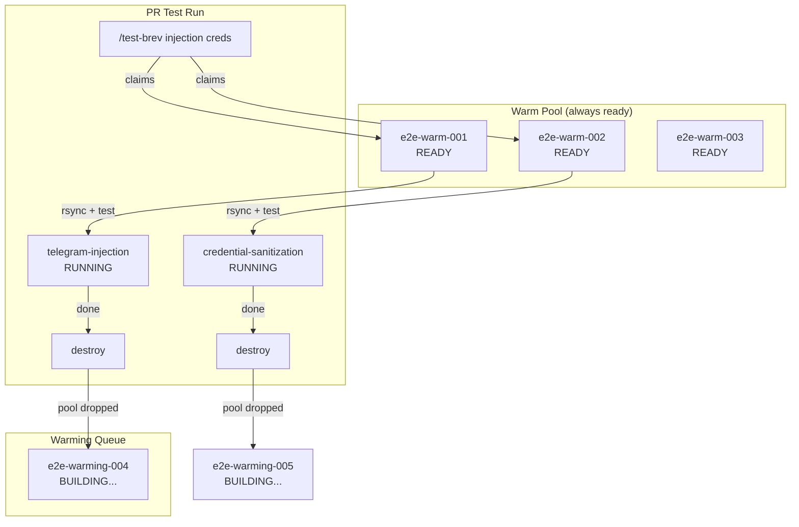
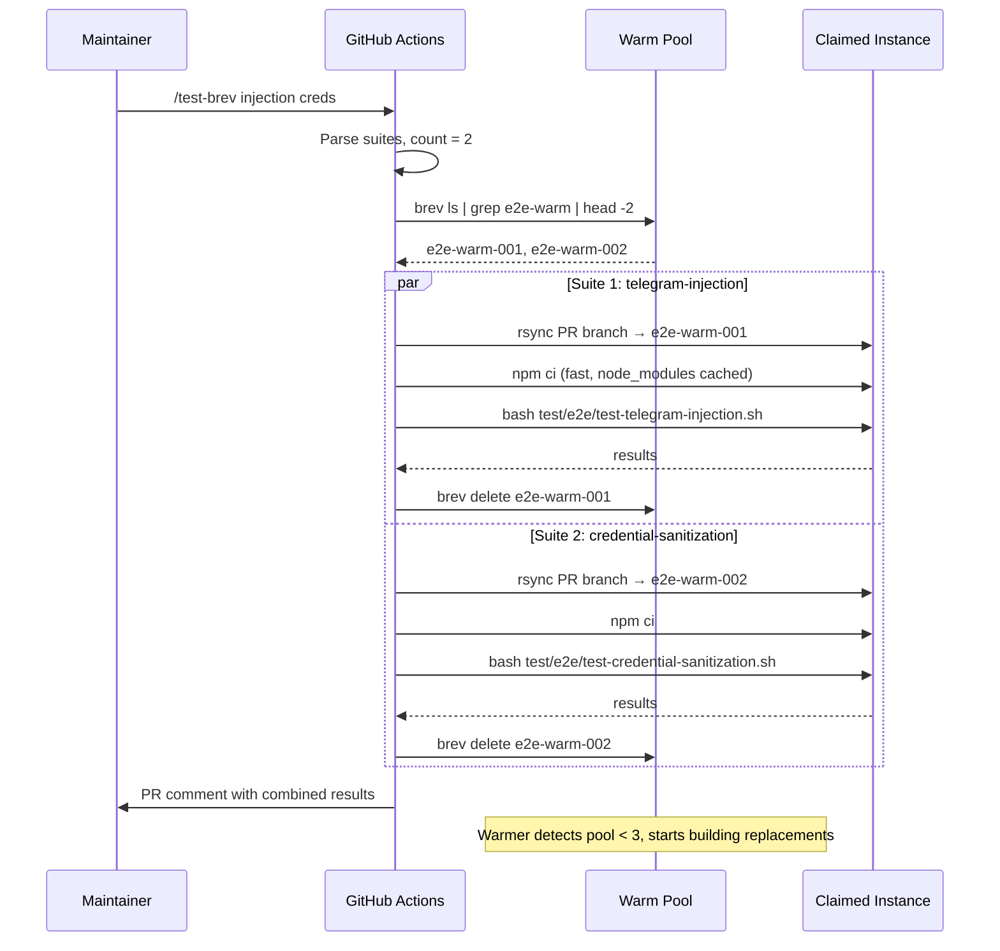

# Warm Pool E2E Security Test Infrastructure

## Overview & Objectives

### Problem Statement

PR #813 established ephemeral Brev E2E testing — spin up a fresh instance, bootstrap it, run tests, tear it down. This works but has a critical performance problem: **the NemoClaw sandbox Docker image build takes 40+ minutes on a cold instance**, making the tests impractical for PR review workflows.

The root cause is `openshell sandbox create --from Dockerfile` which builds a multi-stage Docker image (Node.js builder + Debian runtime with Python, pip, git, OpenClaw, NemoClaw plugin) with zero layer cache on every fresh instance.

Meanwhile, we have two security PRs (#119 and #156) with E2E test suites ready to run (`test-telegram-injection.sh` and `test-credential-sanitization.sh`) but unable to execute because the infrastructure can't get past the bootstrap phase.

### Goals

1. **Eliminate cold-start build time** — tests should begin executing within 3-5 minutes of being triggered, not 40+
2. **Support parallel test execution** — a reviewer can request multiple test suites and they run concurrently on separate instances
3. **PR comment trigger** — maintainers post `/test-brev <suite1> <suite2>` on a PR to launch tests
4. **Self-healing pool** — a daily health check ensures warm instances are available and not drifted
5. **Run the security tests** — validate PR #119 (command injection) and PR #156 (credential sanitization) on real sandbox infrastructure

### Non-Goals

- Replacing the existing Docker sandbox E2E or nightly cloud E2E (they remain as-is)
- GPU testing — security tests need CPU-only instances
- Modifying the NemoClaw Dockerfile for faster builds (separate concern)

## Current State Analysis

### What Exists (from PR #813)

| Component | File | Status |
|-----------|------|--------|
| Vitest E2E harness | `test/e2e/brev-e2e.test.js` | Merged to main — creates ephemeral Brev instance, rsyncs code, bootstraps, runs tests |
| GitHub Actions workflow | `.github/workflows/e2e-brev.yaml` | Merged — `workflow_dispatch` + `workflow_call`, PR reporting, test suite dropdown |
| Full E2E test | `test/e2e/test-full-e2e.sh` | Merged — 6-phase test covering install → inference → cleanup |
| Bootstrap script | `scripts/brev-setup.sh` | Merged — installs Docker, Node.js, openshell, runs setup.sh |

### What We Built (this branch: `feat/security-e2e-tests`)

| Component | File | Status |
|-----------|------|--------|
| Telegram injection tests | `test/e2e/test-telegram-injection.sh` | Written — 8 tests across 6 phases |
| Credential sanitization tests | `test/e2e/test-credential-sanitization.sh` | Written — 13 tests across 6 phases |
| Workflow dropdown update | `.github/workflows/e2e-brev.yaml` | Modified — added `telegram-injection` option |
| Vitest suite wiring | `test/e2e/brev-e2e.test.js` | Modified — added telegram-injection test case |

### The Bottleneck

Four CI runs confirmed the same failure: `brev-setup.sh` → `setup.sh` → `openshell sandbox create --from Dockerfile` hangs for 40+ minutes on cold instances. Increasing instance size to 8x32 did not help. The Dockerfile build pulls base images, installs packages, compiles TypeScript — all uncacheable on a fresh box.

### NemoClaw Brev Launchable

A pre-configured NemoClaw launchable exists at:
```
https://brev.nvidia.com/launchable/deploy?launchableID=env-3Azt0aYgVNFEuz7opyx3gscmowS
```

- **Startup script**: Downloads and runs `launch-nemoclaw.sh` from OpenShell-Community repo
- **Result**: Instance with Docker, openshell, NemoClaw sandbox fully built and running
- **Build time**: Same 40+ min, but happens during instance provisioning
- **Spec**: 4 CPUs, 16 GiB RAM, 256 GiB disk, GCP
- **Cost**: $0.13/hr

The startup script:
```bash
#!/bin/bash
curl -fsSL https://raw.githubusercontent.com/NVIDIA/OpenShell-Community/refs/heads/feat/brev-nemoclaw-plugin/brev/launch-nemoclaw.sh |
  CLI_RELEASE_TAG=v0.0.10 PLUGIN_REF=main COMMUNITY_REF=feat/brev-nemoclaw-plugin bash
```

### CLI Limitations (Validated 2026-03-25)

**`brev start --setup-script` does NOT replicate the launchable.** Tested:
```bash
brev start https://github.com/NVIDIA/NemoClaw \
  --name e2e-warm-test-001 --cpu 4x16 \
  --setup-script "https://raw.githubusercontent.com/.../launch-nemoclaw.sh"
```
Result: bare Ubuntu VM with nothing installed. The `--setup-script` flag was silently ignored. The `--cpu` flag was also ignored — it created a GPU instance ($0.72/hr) instead.

**Implication**: Warm instances must be bootstrapped via `brev create --org "Nemoclaw CI/CD" --cpu 4x16` followed by SSH-based `brev-setup.sh` execution (the #813 approach), NOT via `brev start` with the launchable URL. The launchable is only deployable through the Brev web UI.

**Org must be explicit**: Without `--org`, instances land in the user's active org. The `BREV_API_TOKEN` from CI landed instances in `nca-40221` (GPU-default org) instead of `Nemoclaw CI/CD` (CPU-default org). Six orphaned GPU instances at $0.72/hr each were discovered and cleaned up.

## Architecture Design

### The Warm Pool Model

Instead of building fresh instances on demand, maintain a pool of **pre-warmed instances** that are already built and ready. When a test claims one, a replacement starts warming immediately.



### Instance Naming Convention (Replaces State Files)

Instance state is encoded in the name — no external state tracking needed:

| Name Pattern | Meaning | Query |
|-------------|---------|-------|
| `e2e-warm-NNN` | Warm, ready to claim | `brev ls \| grep e2e-warm-` |
| `e2e-run-RUNID` | Claimed by CI run | `brev ls \| grep e2e-run-` |

The `brev ls` command is the single source of truth. No files, no databases, no race conditions beyond what `brev create`/`brev delete` already handle.

### Claiming an Instance (Atomic via Rename)

Brev doesn't support renaming, so claiming works via a **marker file** on the instance:

1. List `e2e-warm-*` instances via `brev ls`
2. SSH into the first one: `ssh e2e-warm-001 "echo CLAIMED-BY-$RUN_ID > /tmp/.e2e-claim"`
3. If SSH succeeds and file is written, the instance is claimed
4. If two workflows race, the second one sees the claim file and tries the next instance

Alternative (simpler): use **GitHub Actions concurrency groups** per instance name to prevent double-claiming.

### Test Execution Flow



### Code Deployment to Warm Instance

When an instance is claimed, the PR branch code replaces the repo:

```bash
# 1. Wipe existing repo (clean slate — no leftover files)
ssh $INSTANCE "rm -rf ~/nemoclaw"

# 2. Rsync fresh code (exclude .git to save transfer time)
rsync -az --exclude .git "$REPO_DIR/" "$INSTANCE:~/nemoclaw/"

# 3. Install dependencies (deterministic from lockfile)
ssh $INSTANCE "cd ~/nemoclaw && npm ci"

# 4. Restart sandbox with potentially new Dockerfile
#    Uses Docker layer cache — fast if Dockerfile unchanged
ssh $INSTANCE "cd ~/nemoclaw && openshell sandbox delete e2e-test 2>/dev/null || true"
ssh $INSTANCE "cd ~/nemoclaw && bash scripts/setup.sh"
```

Step 4 (sandbox rebuild) leverages Docker layer cache on the warm instance. If the Dockerfile hasn't changed (typical for security test runs), this takes seconds. If it has changed, the base layers are still cached — only modified layers rebuild.

### Daily Health Check & Cycling

A scheduled workflow runs every morning (and every 30 min during business hours):

1. **Count warm instances**: `brev ls | grep -c e2e-warm-`
2. **Health-check each**: SSH → verify sandbox is Ready, openshell responds, Docker runs
3. **Age check**: Destroy any instance older than 24 hours (prevents drift)
4. **Top up**: If count < target (3), start new instances from launchable
5. **Report**: Post status to a GitHub issue or workflow summary

### Cost Model

| Scenario | Instances | Hours/Day | Cost/Day | Cost/Month |
|----------|-----------|-----------|----------|------------|
| Business hours only (8am-8pm ET, weekdays) | 3 | 12 | $4.68 | $103 |
| 24/7 (constant availability) | 3 | 24 | $9.36 | $281 |
| Scaled up (parallel demand) | 5 | 12 | $7.80 | $172 |

Instances are destroyed and rebuilt daily, so stopped-instance storage costs are zero.

## Configuration & Deployment Changes

### Secrets (GitHub Repository)

| Secret | Purpose | Exists? |
|--------|---------|---------|
| `NVIDIA_API_KEY` | Inference config during sandbox setup | Yes |
| `BREV_API_TOKEN` | Brev CLI headless auth | Yes (from #813) |

### Brev Organization

**All instances MUST be created in the `Nemoclaw CI/CD` org.**

| Org Name | Org ID | Purpose |
|----------|--------|---------|
| `Nemoclaw CI/CD` | `org-3BMXNQMeQUOorcczhv3RX6znPCa` | E2E test instances |

Every `brev` CLI command that creates, lists, or deletes instances must include `--org "Nemoclaw CI/CD"`. Without this, instances end up in whichever org the `BREV_API_TOKEN` user has set as active — which led to 6 orphaned GPU instances at $0.72/hr in the wrong org during initial development.

**Lesson learned from PR #813**: The merged workflow did not specify `--org`, causing instances to land in `nca-40221` as GPU instances (T4, $0.72/hr) instead of CPU instances ($0.13/hr) in the CI/CD org. This must be fixed.

### Environment Variables (Workflow)

| Variable | Purpose | Default |
|----------|---------|---------|
| `BREV_ORG` | Brev org for all instance operations | `Nemoclaw CI/CD` |
| `WARM_POOL_SIZE` | Target number of warm instances | `3` |
| `WARM_POOL_PREFIX` | Instance name prefix | `e2e-warm-` |
| `BREV_CPU` | Instance CPU spec | `4x16` |
| `INSTANCE_MAX_AGE_HOURS` | Max instance age before cycling | `24` |
| `LAUNCHABLE_ID` | NemoClaw Brev launchable ID | `env-3Azt0aYgVNFEuz7opyx3gscmowS` |

### New Files

| File | Purpose |
|------|---------|
| `.github/workflows/e2e-pool-warmer.yaml` | Scheduled workflow: health check + top up warm pool |
| `.github/workflows/e2e-brev-trigger.yaml` | `issue_comment` workflow: parse `/test-brev` and dispatch |
| `.github/workflows/e2e-brev.yaml` | Modified: support warm pool claim/release + parallel matrix |
| `scripts/e2e-pool.sh` | Pool management helpers: list, claim, health-check, warm |
| `test/e2e/brev-e2e.test.js` | Modified: warm pool mode (skip create/bootstrap if instance provided) |

### Modified Files

| File | Change |
|------|--------|
| `test/e2e/brev-e2e.test.js` | Add `WARM_INSTANCE` env var support — skip create+bootstrap when set |
| `.github/workflows/e2e-brev.yaml` | Add warm pool claim step, parallel matrix for suites, repo guard logic |
| `scripts/brev-setup.sh` | Already has `SKIP_VLLM` support; no further changes needed |

## Implementation Phases

## Phase 1: Pool Management Script

**Description**: Shell script that manages the warm pool — list available instances, claim one, health-check, and warm up new ones.

**Core Functionality**: A single `scripts/e2e-pool.sh` with subcommands that CI workflows call.

**New file**: `scripts/e2e-pool.sh`

**Design**:

All subcommands pass `--org "$BREV_ORG"` (default: `Nemoclaw CI/CD`) to every `brev` CLI call. This is non-negotiable — missing `--org` caused $0.72/hr GPU orphans during development.

Subcommands:

- `e2e-pool.sh list` — List warm instances (name, status, age)
  - Runs `brev ls --org "$BREV_ORG"`, filters by `$WARM_POOL_PREFIX`, parses output
  - Output: one instance per line, format: `NAME STATUS AGE_MINUTES`
  - Exit 0 always (empty list is valid)

- `e2e-pool.sh count` — Count available warm instances
  - Filters `list` output to `RUNNING` + `COMPLETED` + `READY` status
  - Output: single integer
  - Used by warmer to decide how many to top up

- `e2e-pool.sh claim` — Claim the first available warm instance
  - Runs `list`, picks first ready instance
  - SSHs in: writes `/tmp/.e2e-claimed` with `$GITHUB_RUN_ID`
  - Verifies claim by reading it back
  - Output: instance name on stdout, or exit 1 if none available
  - Includes retry logic: if claim file already exists (race), try next instance

- `e2e-pool.sh health-check <name>` — Verify instance is healthy
  - SSH: `echo ok` (connectivity)
  - SSH: `openshell sandbox list` (openshell works)
  - SSH: `docker info` (Docker running)
  - SSH: `node --version` (Node.js present)
  - Output: `HEALTHY` or `UNHEALTHY: <reason>`
  - Exit 0 for healthy, exit 1 for unhealthy

- `e2e-pool.sh warm [count]` — Start new warm instances to reach target pool size
  - Uses `brev start` with NemoClaw repo URL + launchable startup script
  - Names: `e2e-warm-$(date +%s)-NNN` (timestamp prevents collisions)
  - Runs `--detached` — doesn't wait for build to complete
  - Output: names of instances being warmed

- `e2e-pool.sh cycle` — Destroy instances older than `$INSTANCE_MAX_AGE_HOURS`
  - Compares instance creation time against threshold
  - Runs `brev delete` for expired instances
  - Output: names of destroyed instances

- `e2e-pool.sh deploy <name> <repo-dir>` — Deploy branch code to a claimed instance
  - `ssh <name> "rm -rf ~/nemoclaw"`
  - `rsync -az --exclude .git <repo-dir>/ <name>:~/nemoclaw/`
  - `ssh <name> "cd ~/nemoclaw && npm ci"`
  - Verifies: `ssh <name> "cd ~/nemoclaw && node -e 'require(\"./package.json\")'"` 
  - Exit 0 on success, 1 on failure

**Dependencies**: Brev CLI on PATH, `brev login` already completed.

**Acceptance Criteria**:
- `e2e-pool.sh list` returns warm instances from `brev ls`
- `e2e-pool.sh claim` atomically claims an instance and returns its name
- `e2e-pool.sh health-check <name>` correctly reports healthy/unhealthy instances
- `e2e-pool.sh warm` creates instances using the launchable startup script
- `e2e-pool.sh deploy` wipes existing code, rsyncs fresh, runs `npm ci`
- `e2e-pool.sh cycle` destroys instances older than threshold
- All subcommands handle errors gracefully (instance not found, SSH timeout, etc.)

## Phase 2: Pool Warmer Workflow

**Description**: Scheduled GitHub Actions workflow that maintains the warm pool at target size and cycles stale instances.

**New file**: `.github/workflows/e2e-pool-warmer.yaml`

**Design**:

- **Trigger**: `schedule` (cron: `*/30 8-20 * * 1-5` — every 30 min, business hours, weekdays) + `workflow_dispatch` (manual)
- **Guard**: `if: github.repository == 'NVIDIA/NemoClaw'`
- **Timeout**: 10 minutes

Steps:
1. Install Brev CLI (pinned version)
2. `brev login --token $BREV_API_TOKEN`
3. Run `e2e-pool.sh cycle` — destroy instances older than 24 hours
4. Run `e2e-pool.sh list` — enumerate current pool
5. Health-check each instance: `e2e-pool.sh health-check <name>`
6. Destroy unhealthy instances: `brev delete <name>`
7. Count remaining healthy instances
8. If count < `$WARM_POOL_SIZE`: run `e2e-pool.sh warm $(($WARM_POOL_SIZE - $count))`
9. Summary output: pool status table (name, status, age, health)

**Dependencies**: Phase 1 (`e2e-pool.sh` exists). `BREV_API_TOKEN` secret.

**Acceptance Criteria**:
- Workflow runs on schedule and maintains pool at target size
- Stale instances (>24h) are destroyed and replaced
- Unhealthy instances are destroyed and replaced
- Workflow summary shows pool status table
- Manual dispatch works for on-demand pool top-up

## Phase 3: Warm Pool Test Runner

**Description**: Modify the existing `e2e-brev.yaml` workflow and `brev-e2e.test.js` to support warm pool mode — claim a pre-built instance instead of creating one from scratch.

**Modified files**: `.github/workflows/e2e-brev.yaml`, `test/e2e/brev-e2e.test.js`

**Design**:

### Workflow Changes (`e2e-brev.yaml`)

Add a new input `pool_mode` (default: `true`). When enabled:

1. **Claim step** (before vitest): 
   - Run `e2e-pool.sh claim`
   - If claim succeeds: set `WARM_INSTANCE` env var to the instance name
   - If no instances available: fall back to ephemeral mode (create fresh)

2. **Deploy step** (before vitest):
   - Run `e2e-pool.sh deploy $WARM_INSTANCE .`

3. **Run step**: Pass `WARM_INSTANCE` to vitest via env

4. **Cleanup step** (always):
   - `brev delete $WARM_INSTANCE` (consumed instance — warmer will replace it)

### Vitest Changes (`brev-e2e.test.js`)

Add `WARM_INSTANCE` env var support:

```javascript
const WARM_INSTANCE = process.env.WARM_INSTANCE;

beforeAll(() => {
  if (WARM_INSTANCE) {
    // Warm pool mode: instance already exists, code already deployed
    // Just verify connectivity
    ssh("echo ok");
    remoteDir = ssh("echo $HOME") + "/nemoclaw";
  } else {
    // Ephemeral mode: original create + bootstrap flow (fallback)
    // ... existing code ...
  }
});

afterAll(() => {
  // In warm pool mode, the workflow handles deletion
  // In ephemeral mode, delete as before
  if (!WARM_INSTANCE && instanceCreated) {
    brev("delete", INSTANCE_NAME);
  }
});
```

### Parallel Matrix for Multiple Suites

When multiple test suites are requested, the workflow fans out across a matrix:

```yaml
jobs:
  claim-instances:
    outputs:
      matrix: ${{ steps.build-matrix.outputs.matrix }}
    steps:
      - id: build-matrix
        run: |
          # Parse TEST_SUITE input, claim one instance per suite
          SUITES=$(echo "$TEST_SUITE" | tr ',' ' ')
          MATRIX="["
          for suite in $SUITES; do
            INSTANCE=$(scripts/e2e-pool.sh claim)
            MATRIX="$MATRIX{\"suite\":\"$suite\",\"instance\":\"$INSTANCE\"},"
          done
          MATRIX="${MATRIX%,}]"
          echo "matrix=$MATRIX" >> "$GITHUB_OUTPUT"

  run-tests:
    needs: claim-instances
    strategy:
      matrix: ${{ fromJson(needs.claim-instances.outputs.matrix) }}
      fail-fast: false
    steps:
      - run: scripts/e2e-pool.sh deploy ${{ matrix.instance }} .
      - run: # run test suite on instance
      - if: always()
        run: brev delete ${{ matrix.instance }}
```

**Dependencies**: Phase 1 (pool script), Phase 2 (warmer ensuring instances exist).

**Acceptance Criteria**:
- When `WARM_INSTANCE` is set, vitest skips instance creation and bootstrap
- When `WARM_INSTANCE` is not set, falls back to ephemeral mode
- Test execution on a warm instance starts within 3-5 minutes of trigger
- Multiple suites run in parallel on separate instances
- All claimed instances are destroyed after tests complete
- Results are reported back to the PR with per-suite status

## Phase 4: PR Comment Trigger

**Description**: Workflow that lets maintainers trigger E2E tests by posting `/test-brev <suites>` on a PR.

**New file**: `.github/workflows/e2e-brev-trigger.yaml`

**Design**:

- **Trigger**: `issue_comment` (type: `created`)
- **Guard**: Comment on a PR (not issue), starts with `/test-brev`, author is in maintainer list
- **Maintainer allowlist**: `ericksoa kjw3 jacobtomlinson cv jyaunches`

Steps:
1. Validate: is this a PR comment? Does it start with `/test-brev`? Is author a maintainer?
2. Parse suites from comment: `/test-brev injection creds` → `telegram-injection,credential-sanitization`
3. Suite name aliases:
   - `injection` / `telegram` → `telegram-injection`
   - `creds` / `credentials` / `sanitization` → `credential-sanitization`
   - `full` → `full`
   - `all` → `all` (runs everything)
4. Post 👀 reaction on the comment (acknowledge receipt)
5. Dispatch `e2e-brev.yaml` via `gh workflow run` with:
   - `branch`: PR head branch (extracted via `gh pr view`)
   - `pr_number`: PR number
   - `test_suite`: comma-separated suite names
   - `pool_mode`: `true`
6. Post comment: "🚀 Triggered E2E tests: `telegram-injection`, `credential-sanitization` on branch `fix/foo` — [Watch run](url)"

**Dependencies**: Phase 3 (e2e-brev.yaml supports pool mode + parallel matrix).

**Acceptance Criteria**:
- Maintainer posting `/test-brev injection creds` triggers two parallel test suites
- Non-maintainer posting `/test-brev` is silently ignored
- Comment on an issue (not PR) is silently ignored
- 👀 reaction is added to acknowledge the command
- Follow-up comment links to the workflow run
- Results are posted back to the PR when tests complete

## Phase 5: Run Security Tests Against Unfixed Main

**Description**: Execute the security test suites against `main` (unfixed code) to prove they detect the vulnerabilities, then against the PR branches to prove they pass.

**No new files** — this is a validation phase using the infrastructure from Phases 1-4.

**Execution plan**:

1. **Against `main`** (expected: failures)
   - `/test-brev injection creds` on a dummy PR pointing to `main`
   - `test-telegram-injection.sh` should show failures for T1-T4 (injection vectors work on unfixed code)
   - `test-credential-sanitization.sh` should show failures for C1-C3, C6, C9 (credentials not stripped, digest bypassed)

2. **Against PR #119 branch** (`fix/telegram-bridge-command-injection`)
   - `/test-brev injection` 
   - All telegram injection tests should pass

3. **Against PR #156 branch** (`security/sandbox-credential-exposure-and-blueprint-bypass`)
   - `/test-brev creds`
   - All credential sanitization tests should pass

4. **Document results**: Post summary table in both PRs showing before/after

**Dependencies**: Phases 1-4 operational, warm pool running.

**Acceptance Criteria**:
- Security tests fail on `main` (proving they detect real vulnerabilities)
- Security tests pass on their respective fix branches
- Results documented in PR comments with clear before/after comparison

## Phase 6: Clean the House

**Description**: Post-implementation cleanup, documentation, and reverting temporary changes.

**Tasks**:

1. **Restore repo guard**: Re-enable `if: github.repository == 'NVIDIA/NemoClaw'` in `e2e-brev.yaml` (temporarily disabled for fork testing)
2. **Revert instance size**: Change `BREV_CPU` back to `4x16` from `8x32` (warm pool eliminates the need for larger instances)
3. **Remove temporary commits**: Squash the timeout-bumping commits into clean history
4. **Update README.md**: Add section on E2E testing:
   - How to trigger: `/test-brev <suites>`
   - Available suites: `full`, `telegram-injection`, `credential-sanitization`, `all`
   - Who can trigger (maintainer list)
   - How the warm pool works
   - Cost implications
5. **Update CONTRIBUTING.md**: Note that security PRs should be validated with `/test-brev` before merge
6. **Document pool operations**:
   - How to manually top up the pool: `gh workflow run e2e-pool-warmer.yaml`
   - How to check pool status: `brev ls | grep e2e-warm`
   - How to refresh `BREV_API_TOKEN` when it expires
7. **Clean up specs/**: Archive the original #813 spec, update with final state

**Acceptance Criteria**:
- No commented-out code blocks remain
- No temporary timeout hacks remain
- Repo guard is restored
- Documentation reflects current state of infrastructure
- All TODOs from implementation are resolved or documented
- `BREV_API_TOKEN` refresh process is documented
